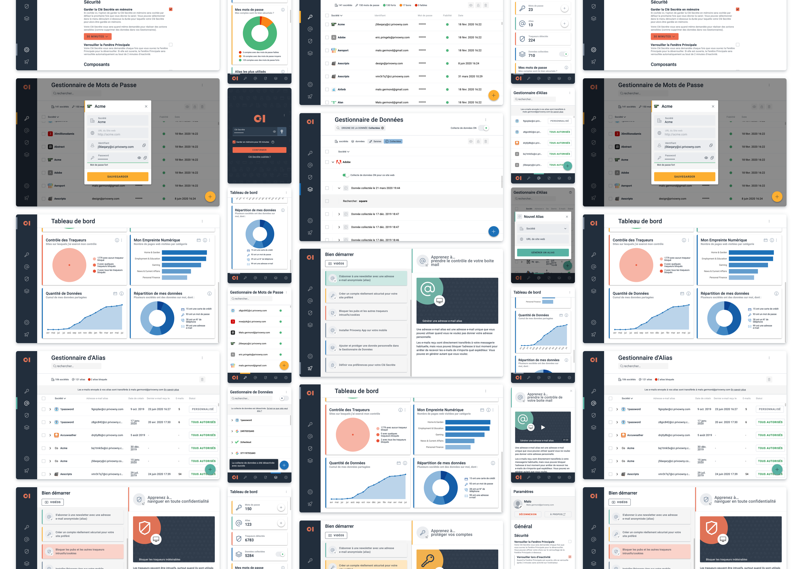

# Un produit en marque blanche

# Un Design System pour n'importe qu'elle marque

Pour permettre la customisation du produit, nous avons mis en place un design system. Au delà de réduire le coût de l’implémentation et d’assurer une cohérence entre les différents fronts, notre design system permet d’assurer un niveau d’accessibilité AA.

# Animation

# Production d'illustration et automatisation
