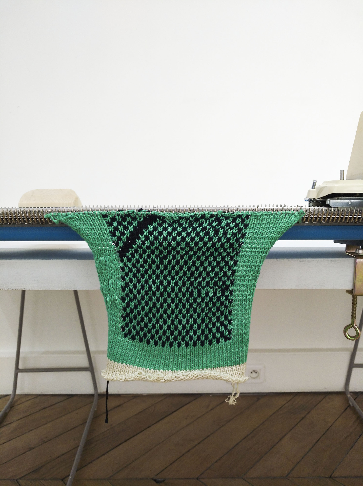

[[fullWidth]]
|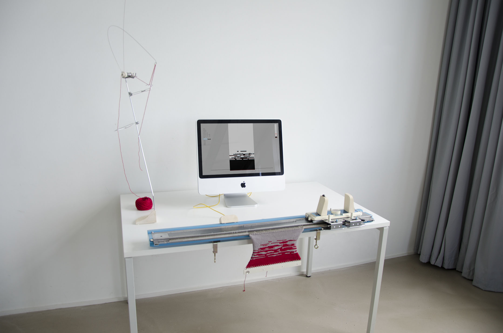

## Le dispositif

Dans un programme, les données d’un ordinateur sont comme les mailles d’un tricot, ce sont de petits éléments, qui mis en forme et assemblées par le code, interagissent entre eux et créent un ensemble lisible et compréhensible. Pratiquer la machine à tricoter nous amène à comprendre son fonctionnement : c’est à dire comment sa matière, la laine se forme en maille puis en tricot.

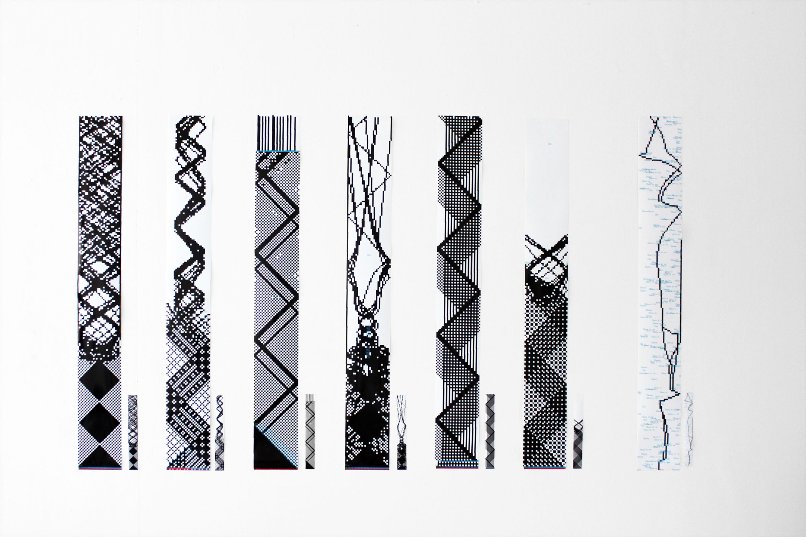

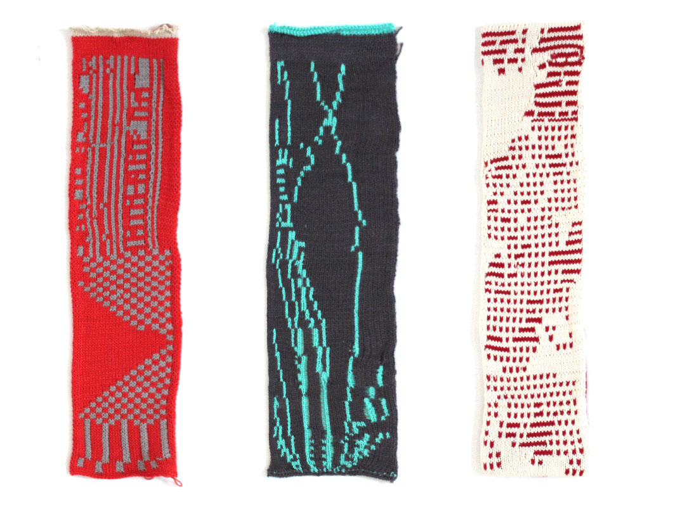

## Le mode d'emploi

Édition accompagnant l'interface qui liste les différents éléments et explique leurs fonctionnements.

[[galleryCol3]]
|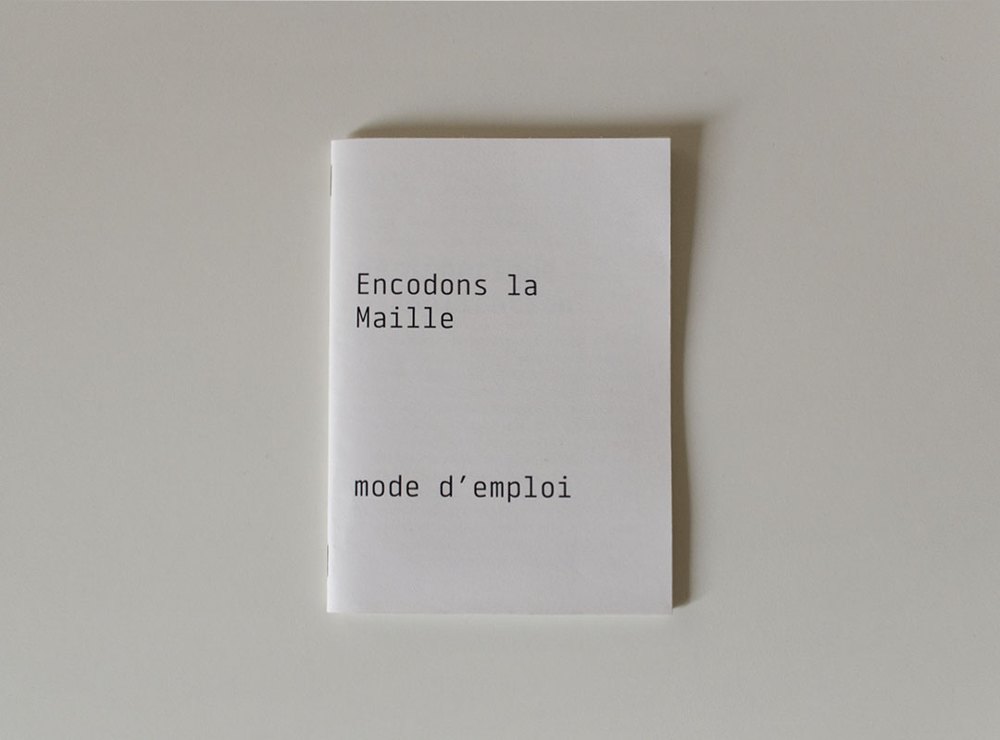
|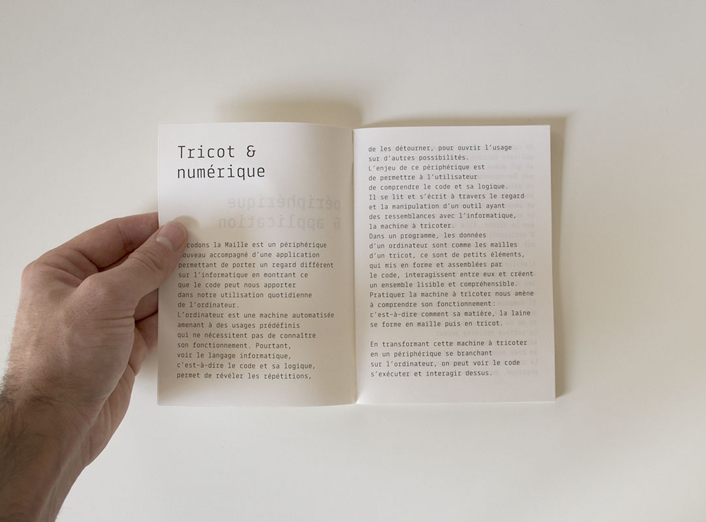
|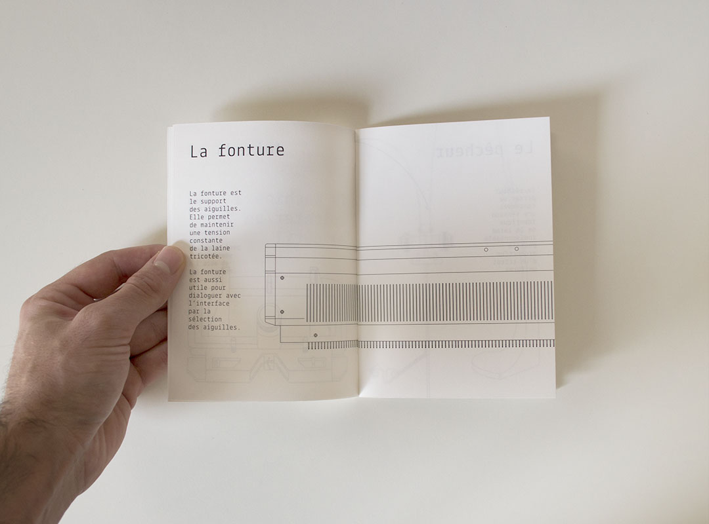
|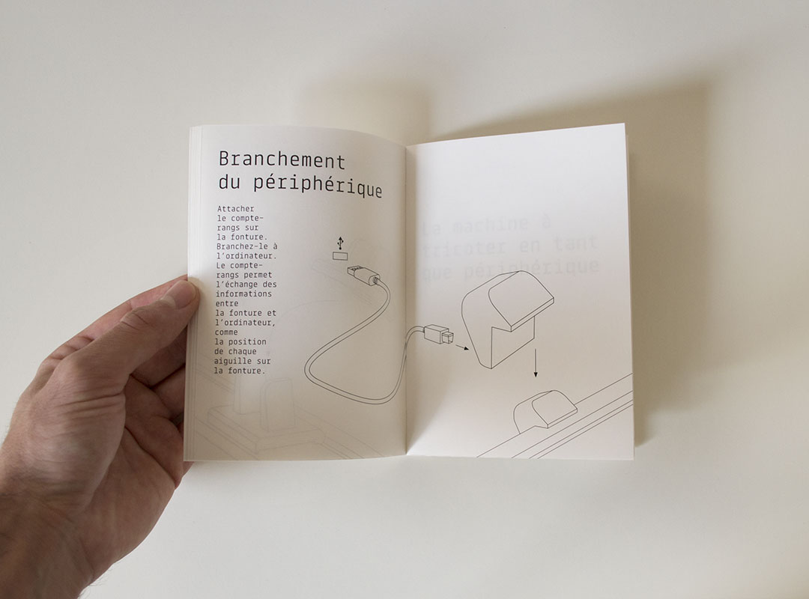
|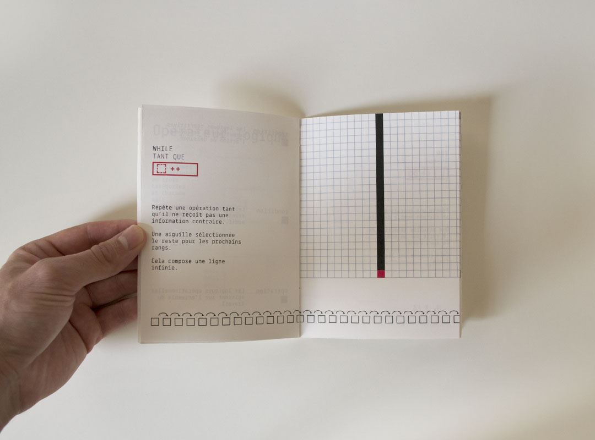
|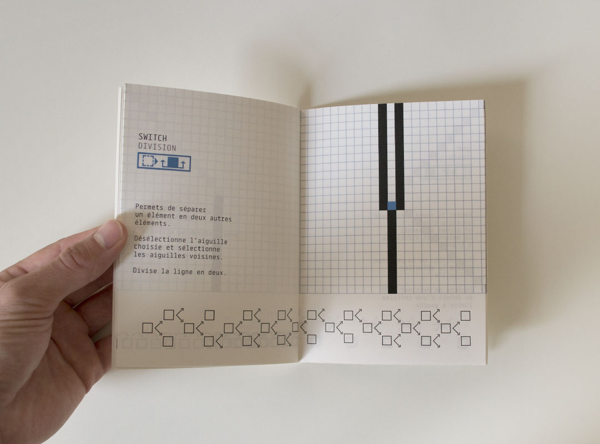

[[galleryCol3]]
|
|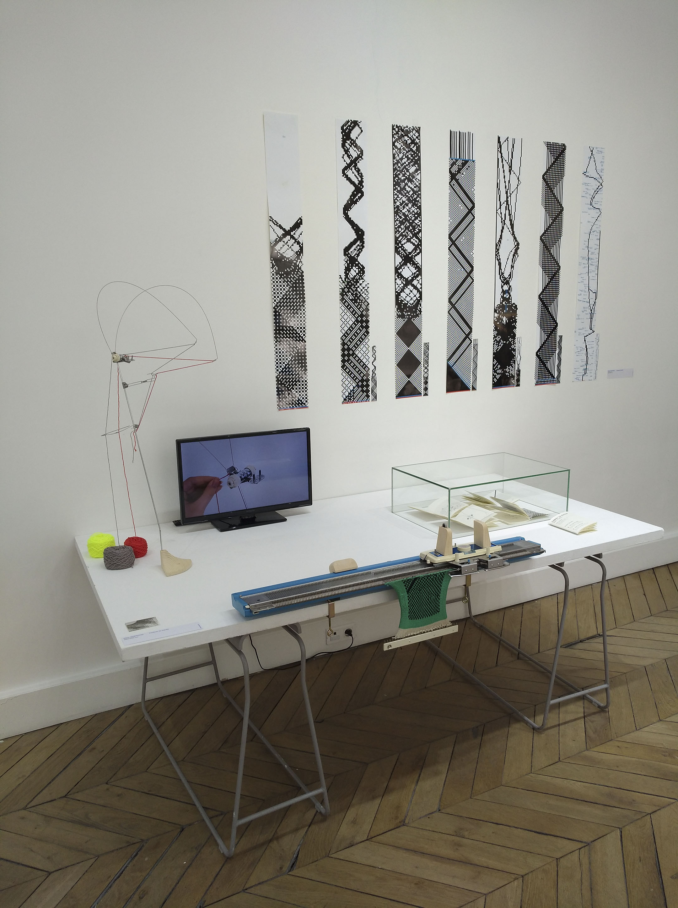
|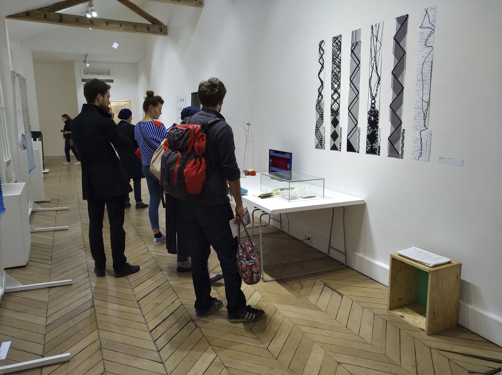
